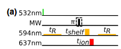
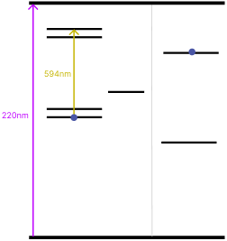

# High fidelity for SCC
--------

## 1. SCC (State-Charge-Conversion)

NV center has a dynamics over NV$^-$ and NV$^0$ and SCC is a way to control these states with other laser (not only 532nm)
SCC could make higher fidelity ($NV^{-}$ contrast is not good enough).
for conventional NV, we've used 532nm for init and readout. But SCC uses others like 594nm and 638nm to control the charge dynamics

(SCC is just a readout sequance)

### 532nm, 594nm, 638nm, NIR

**532nm**
init, $|1 \rangle$ to singlet, $|0 \rangle$ to triplet, when init 70% getting NV$^-$
I think there would be a sequance like... : 532nm $\rightarrow$ probe $\rightarrow$ if NV$^-$ start sequance, if not start init again 

**638nm**
making triplet state ionized to NV$^0$, then $|1 \rangle$ would be only in NV$^-$ (most ideal) 

**594nm**  
checking the ionized state, NV$^-$ ZPL is 637nm and NV$^0$ is 575nm and the 594nm is the middle of the energy band, also could ionize the triplet $|0 \rangle$ to NV$^0$.
594nm with low power $\gamma$ linearly increase and $g$ quadrically increases, could readout the charge state without ionization

**NIR**
ionize $|1 \rangle$ in singlet to NV$^0$, and the triplet is maintained as NV$^-$

### Sequances

>1. 532nm pump $\rightarrow$  init
>2. t$_R$ low power laser with 594nm $\rightarrow$ postselection
>3. Apply MW targeted ($|0 \rangle$ or $|1 \rangle$)
>4. 594nm shelving(t$_{shelf}$), make  $|1 \rangle$) to singlet state(lifetime ~150ns)
>5. 638nm ionization(t$_{ion}$), make triplet $|0 \rangle$ to NV$^0$
>6. Reading charge state with t$_R$. (Different from conventional readout, Ex) n$_{thresh}$ $\ge$ n

(Without 638nm, strong power 594nm does ionization and shelving both)

### Some scaling for intuitive in SCC
> 1. SCC readout time is long so this is best when the T$_2^*$ is long enough
> 2. almost 1 photon means it's NV$^-$
> 3. $\gamma_{+} \approx 720 \text{ Hz}, \gamma_{-} \approx 50 \text{ Hz}, \Gamma_{+} \approx 3.6 \text{ Hz}, \Gamma_{-} \approx 0.98 \text{ Hz}$ （For intuitive understanding, When 594nm)

## 2. Nuclear spin anscila

to simply explain, this is making $^{13}$C as memory with CNOT gates.