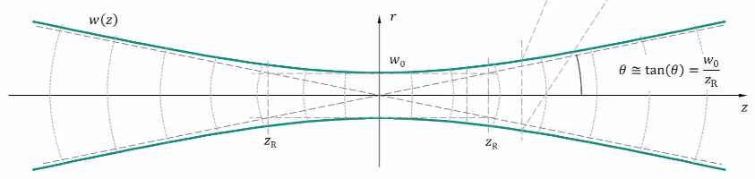
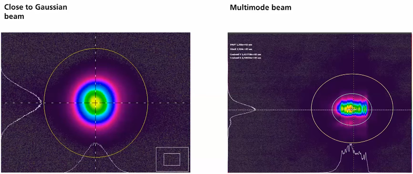
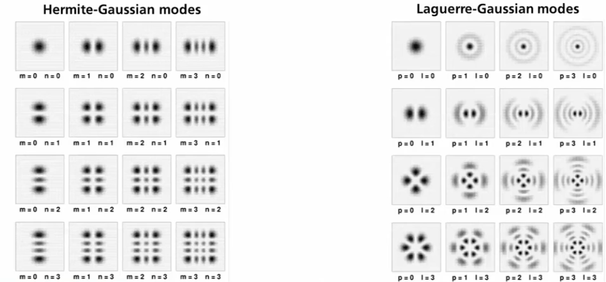

# Laser applications
-----
#### Gaussian beam
-----

###### Transversal intensity distribution$$I(z,r)=\frac{2P}{\pi w(z)^2}\exp\left(-2\frac{r^2}{w(z)^2}\right)$$

###### Beam radius as a function of position (caustic)$$w(z)=w_0\sqrt{1+\left(\frac{z}{z_R}\right)^2}$$

###### Rayleigh length$$z_R=\frac{\pi w_0^2}{\lambda}$$

-----
#### Beam quality
-----
$w_0$ and $\theta$ depends only on the wavelength 

>left is the best quality(TEM$_{00}$ mode), the right side is a mixture of many modes

>The modes that could be mixed
the HG and LG is the Helmholtz wave equation's solution but it matters if it is about Cartesian or cylindrical. This would depend on the cavity  

Could know the quality of the gaussian beam by M$^2$ value. (must be small)

-----
#### Maxwell's equation
-----

Electromagnatic characteristic of matter

| Name | Integral form | Differential form | Message and content |
|---|---|---|---|
| Gauss’s law | $$\oiint_{\partial V} \vec{D}\cdot \vec{n}\,do = \iiint_V \rho\,d^3x$$ | $$\nabla \cdot \vec{D} = \rho$$ | Electric charges and spatially varying polarizations are the sources of electric fields. |
| Gauss’s law for magnetism | $$\oiint_{\partial V} \vec{B}\cdot \vec{n}\,do = 0$$ | $$\nabla \cdot \vec{B} = 0$$ | Magnetic monopoles do not exist. |
| Faraday’s law of induction | $$\oint_{\partial A} \vec{E}\cdot d\vec{s} = -\iint_A \dot{\vec{B}}\cdot \vec{n}\,do$$ | $$\nabla \times \vec{E} = -\dot{\vec{B}}$$ | Temporal changes in the magnetic flux $$\Phi$$ induce electric fields. |
| Maxwell–Ampere equation | $$\oint_{\partial A} \vec{H}\cdot d\vec{s} = \iint_A \left(\vec{J}+\dot{\vec{D}}\right)\cdot \vec{n}\,do$$ | $$\nabla \times \vec{H} = \vec{J}+\dot{\vec{D}}$$ | Currents and displacement currents generate magnetic fields. |
| Material equations | $$\vec{D}=\varepsilon_0\vec{E}+\vec{P}, \qquad \vec{H}=\frac{1}{\mu_0}\vec{B}-\vec{M}$$ | — | Electromagnetic fields induce polarizations and magnetizations. 

Maxwell's equation is about the charge and matter at the laser, and can derive the wave equations

-----
#### Wave equations
-----

