# Efficient Readout of a Single Spin State in Diamond via Spin-to-Charge Conversion
### B. J. Shields, Q. P. Unterreithmeier, N. P. de Leon, H. Park, and M. D. Lukin*
-----

### This paper is about the SCC readout sequance using 532nm, 594nm, 638nm lasers
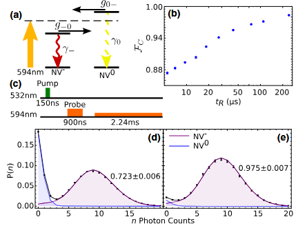
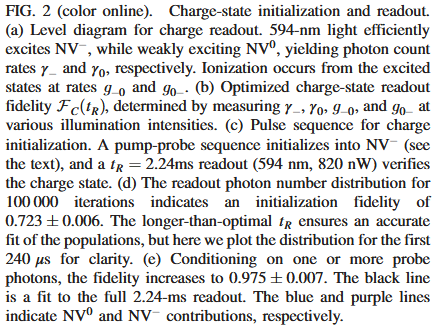
#### With (c) sequance the NV$^-$/NV$^0$ ratio is measured (first the init step) and the result is (d) and (e)
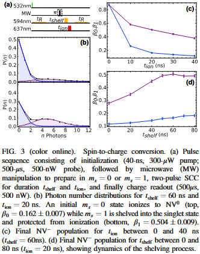
#### (a) is the readout sequance
### Supplemental materials for efficient readout of a single spin state in diamond via  spin-to-charge conversion
$\rightarrow$ **there are supplemental data and expands how they measured and fixed their parameters(photon count, exposure time...)**
 
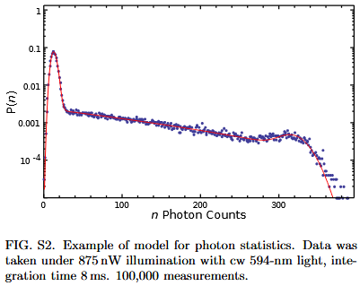
>How? 100,000 times of measure with CW-ODMR
>Probability(y) vs Photon Counts(x)
>there are complicated dynamics so graph doesn't makes a pattern

 

-----
# Photo-induced ionization dynamics of the nitrogen vacancy defect in diamond investigated by single-shot charge state detection  
### N Aslam1,3, G Waldherr1, P Neumann1, F Jelezko2 and J Wrachtrup1
-----
To simplify, this tells about how much power and what frequaency would be the best for the sequance...

 

-----
# Maximal Adaptive-Decision Speedups in Quantum-State Readout
### B. D’Anjou,1 L. Kuret,1 L. Childress,1 and W.A. Coish1,2
-----

Before, what is Bayesian inferance 
 
$$
\underbrace{P(\theta)}_{\text{prior}} \times \underbrace{P(\text{data}|\theta)}_{\text{likelihood}} = \underbrace{P(\theta|\text{data})}_{\text{posterior}}
$$
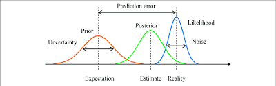
A sequance to make Prior to Posterior with Likelihood(including the real data)
(just have intuition for now...)

In this paper
| Bayesian |  |
| :--- | :--- |
| **$\theta$ (파라미터)** | $NV^{-}$ or $NV^{0}$ — charge state |
| **data** | trajectory $\psi_{t}$ — The number of photons measured per bin, $\delta n$ |
| **Prior $P(\theta)$** | $P(NV^{-}) = P(NV^{0}) = 0.5$ (equal prior) |
| **Likelihood $P(\text{data} \mid \theta)$** | $P(\psi_t \mid NV^{-})$ vs $P(\psi_t \mid NV^{0})$ |
| **Posterior $P(\theta \mid \text{data})$** | Posterior probability of the $NV^{-}$/$NV^{0}$ state given the observed photon trajectory |

Determine to keep measure or not with the posterior.

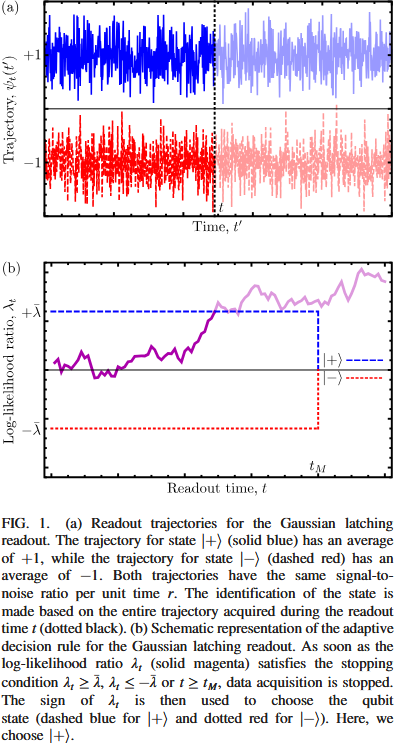

(a) +1 : NV$^-$, -1 : NV$^0$, fluctuating with gaussian noise
(b) the continuous sequance to determine the state

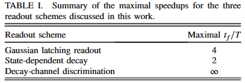

State discrimination methods
>Gaussian  latching readout : NV$^-$ : +, NV$^0$ : -
>State-dependent decay : NV$^-$ : +, constant -
>Decay-channel discrimination : NV$^-$ : 638nm, NV$^0$ : 575nm

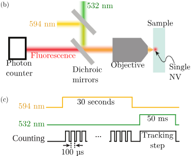

(a) : Set up
(b) : The sequance, CW 30s with 594 and count it

 $\gamma_{+} \approx 720 \text{ Hz}, \gamma_{-} \approx 50 \text{ Hz}, \Gamma_{+} \approx 3.6 \text{ Hz}, \Gamma_{-} \approx 0.98 \text{ Hz}$ （For intuitive understanding, When 594nm)
$\rightarrow$ It couldn't be Gaussian latching readout, more like State dependent decay.

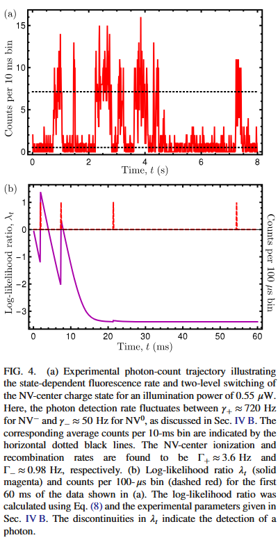

(a) : Getting te parameters of dynamic rates, data of 594nm CW measure (does calibration with these parameter, Appendix B)
(b) : The calibrated graph (This would be NV$^0$, log-likelihood ratio)

### Adaptive Decision Rule — Implementation

#### Calibration
1. Measure rates: $\gamma_+$, $\gamma_-$, $\Gamma_+$, $\Gamma_-$
2. Pre-compute and store update matrices $M(0), M(1), \ldots, M(5)$

#### Real-time Readout (every $\delta t = 0.1$ ms)
1. Observe photon count $\delta n$
2. Retrieve $M(\delta n)$ and perform matrix multiplication
3. Update likelihood ratio $\Lambda_t$
4. Apply stopping condition:
   - $\lambda_t \geq +\bar{\lambda}$ → assign NV$^-$, **stop**
   - $\lambda_t \leq -\bar{\lambda}$ → assign NV$^0$, **stop**
   - $t \geq t_M$ → force stop

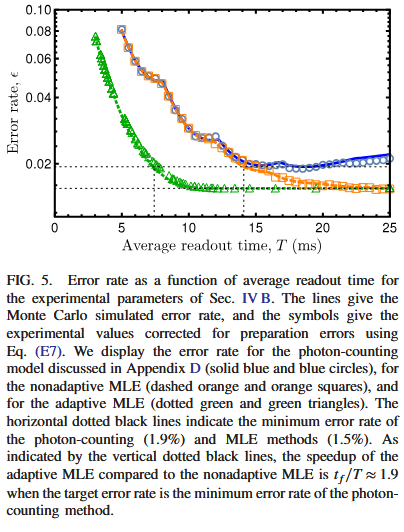

green is adaptive MLE(Maximum Likelihood Estimation) $\rightarrow$ Improved

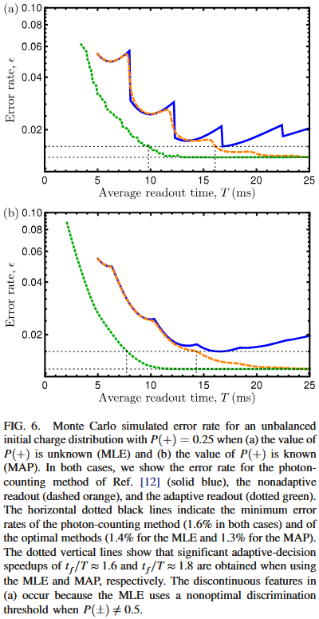

(a) : Didn't multiply the prior (doesn't think of the first state that is 25:75, when 594nm is applied NV ionizes to 25:75 in 220ms)
(b) : multiply the prior (Bayesian inferance)

$\rightarrow$ Doesn't matter, the adaptive rule is robust
Why uncontinuous? $\rightarrow$  

### Organize
#### 1. $\gamma_+$, $\gamma_-$ measuring
30s trajectory, 10ms bin $\rightarrow$ Histogram 
Two poisson distrubution fitting than get the value 
